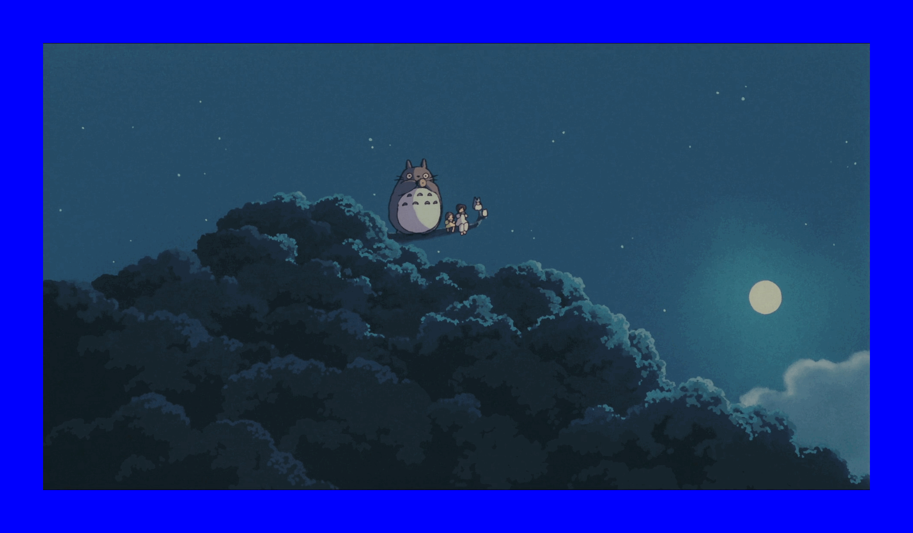

# Example

### Original Images


### Favorites


### Template


```python
template("griffin.gif")
template("jean.gif")
template("totoro.gif")
```
### Border



```python
border("griffin.gif", "#00FF00", 30)
border("jean.gif", "#FF0000", 30)
border("totoro.gif", "#0000FF", 100)
```
### Half


```python
half("griffin.gif")
half("jean.gif")
half("totoro.gif")
```
### Double


```python
double("griffin.gif")
double("jean.gif")
double("totoro.gif")
```
### Side Clone


```python
sideClone("griffin.gif")
sideClone("jean.gif")
sideClone("totoro.gif")
```
### Down Clone


```python
downClone("griffin.gif")
downClone("jean.gif")
downClone("totoro.gif")
```
### Greyscale


```python

greyscale("griffin.gif")
greyscale("jean.gif")
greyscale("totoro.gif")
```
### Smart Border


```python

smartBorder("griffin.gif",30)
smartBorder("jean.gif",30)
smartBorder("totoro.gif",100)
```
### Scale


```python

# scale_factor = float(input("SCALE FACTOR:"))
scale_factor = 0.25
scale("griffin.gif", scale_factor)
scale("jean.gif", scale_factor)
scale("totoro.gif", scale_factor)
```
### Smart Clone


```python

smartClone("griffin.gif",3,2)
smartClone("jean.gif",3,2)
smartClone("totoro.gif",3,2)
```
### Tile


```python
tile("griffin.gif",3,2)
tile("jean.gif",3,2)
tile("totoro.gif",3,2)
```
### Color Substitution


```python

colorSubstitution("griffin.gif", 0.55, 0.15, 1.0)
colorSubstitution("jean.gif", 0.5, 0.5, 1.0)
colorSubstitution("totoro.gif", 0.5, 0.5, 1.0)
```
### Contrast Border


```python
contrastBorder("griffin.gif",30)
contrastBorder("jean.gif",30)
contrastBorder("totoro.gif",100)
```
### Stretch


```python

stretch("griffin.gif",math.pi,1)
stretch("jean.gif", 0.5,1)
stretch("totoro.gif",0.5,0.75)
```
